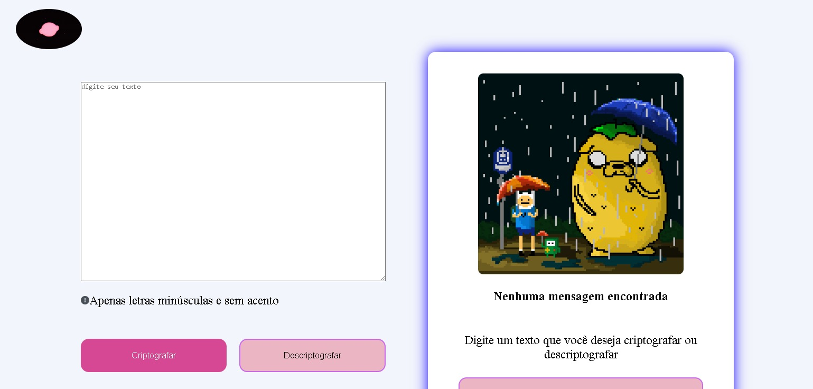

# Challenge ONE

Uma aplicação que criptografa e descriptografa textos.

## Requisitos
- Deve funcionar apenas com letras minúsculas
- Não devem ser utilizados letras com acentos nem caracteres especiais
- Deve ser possível converter uma palavra para a versão criptografada e também retornar uma palavra criptografada para a versão original.

## Screenshot

## Funcionalidades

- Botão para criptografa texto
- Botão para descriptografa texto
- Menu lateral para visualizar texto Descriptografado
- Botão para copiar Texto
- Design Responsivo
- Alertas para os usuarios

## Tecnologias

  
  
  

